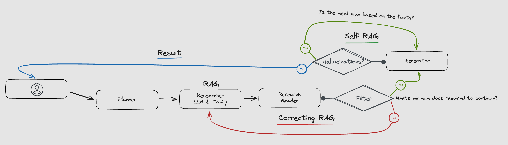

# RecipeAgents

RecipeAgents is a personalized meal plan recommendation system that generates tailored meal plans based on user dietary preferences and available ingredients. This project utilizes the LangGraph framework for defining agent workflows and the Tavily API for fetching recipe data.

## Table of Contents

- [Architecture](#architecture)
- [Agents](#agents)
  - [Planner Agent](#1-planner-agent)
  - [Research Plan Agent](#2-research-plan-agent)
  - [Grader Agent](#3-grader-agent)
  - [Generator Agent](#4-generator-agent)
  - [Reviewer Agent](#5-reviewer-agent)
- [Getting Started](#getting-started)
  - [Prerequisites](#prerequisites)
  - [Installation](#installation)
  - [Usage](#usage)
- [Project Structure](#project-structure)
- [Contributing](#contributing)
- [License](#license)
- [Acknowledgements](#acknowledgements)

## Architecture



## Agents

### 1. Planner Agent

**Task:** Collects user preferences such as dietary restrictions and available ingredients, and creates an initial meal plan.

```python
def plan_node(state, use_saved_data: bool = False):
    # Prepare and save initial meal plan based on user preferences
    messages = [
        SystemMessage(content=PLAN_PROMPT),
        HumanMessage(content=state['task'])
    ]
    response = model.invoke(messages)
    return {"plan": response.content}
```

### 2. Research Plan Agent

**Task:** Uses the Tavily API to search for additional recipes or meal components based on the initial plan and user input.

```python
def research_plan_node(state, use_saved_data: bool = False):
    # Search for recipes and meal components
    queries = model.with_structured_output(Queries).invoke([
        SystemMessage(content=RESEARCH_PROMPT),
        HumanMessage(content=f"{state['task']}\n\nHere is my plan:\n\n{state['plan']}")
    ])
    for q in queries.queries:
        response = tavily.search(query=q, max_results=2)
        for r in response['results']:
            content.append(r['content'])
    return {"content": content}
```

### 3. Grader Agent

**Task:** Grades the relevance of fetched recipes and meal components, ensuring they match user preferences.

```python
def grader_node(state, use_saved_data: bool = False):
    # Grade the relevance of fetched recipes
    content = "\n\n".join(state['content'] or [])
    messages = [
        SystemMessage(content=GRADER_PROMPT.format(content=content)),
        HumanMessage(content=state['task'])
    ]
    response = model.invoke(messages)
    relevant_content = response.content.split('-----')
    grading_score = (len(relevant_content) / len(state['content'])) * 100 if len(state['content']) > 0 else 0
    return {
        "search_number": state["search_number"] + 1,
        "content": relevant_content,
        "grading_score": round(grading_score),
    }
```

### 4. Generator Agent

**Task:** Generates a detailed meal plan using the graded recipes and meal components.

```python
 def generator_node(state, use_saved_data: bool = False):
    # Generate detailed meal plan
    content = "\n\n".join(state['content'] or [])
    user_message = HumanMessage(content=f"{state['task']}\n\nHere is my plan:\n\n{state['plan']}")
    messages = [
        SystemMessage(content=GENERATOR_PROMPT.format(content=content)),
        user_message
    ]
    response = model.invoke(messages)
    state['generated'] = response.content
    return {
        "generated": response.content,
        "revision_number": state.get("revision_number", 1) + 1
    }
```

### 5. Reviewer Agent

**Task:** Reviews the generated meal plan for accuracy and relevance, adjusting as necessary.

```python
def reviewer_node(state, use_saved_data: bool = False):
    # Review generated meal plan for accuracy and relevance
    content = "\n\n".join(state['content'] or [])
    messages = [
        SystemMessage(content=HALLUCINATION_GRADER_PROMPT.format(content=content, generated=state['generated']))
    ]
    response = model.invoke(messages)
    assessments = response.content.split("\n")
    true_count = len([assessment for assessment in assessments if re.search(r'\btrue\b', assessment, re.IGNORECASE)])
    false_count = len([assessment for assessment in assessments if re.search(r'\bfalse\b', assessment, re.IGNORECASE)])
    hellucination_score = (false_count / (true_count + false_count)) * 100 if (true_count + false_count) > 0 else 0
    return {
        "final_review": assessments,
        "hellucination_score": state["hellucination_score"] + round(hellucination_score),
        'generated': state['generated']
    }
```

## Getting Started

### Prerequisites

- Python 3.0
- tailwindcss 3.4.4
- typescript 5.2.2
- vite 5.3.1
- axios 1.7.2
- Tavily API key (sign up for an API key at [Tavily](https://api.tavily.com))
- Open Ai API key (sign up for API key at [OpenAI](https://openai.com/index/openai-api/))
- LangGraph library (pip install langgraph)
- Requests library (pip install requests)
- Flask library (pip install flask)

### Installation

1. Clone the repository:

   ```sh
   git clone https://github.com/AhmxdNYC/RecipeAgents.git
   cd RecipeAgents
   ```

2. Install the required dependencies:

```sh
 # Run from root directory
 npm run install:all
 # For Python
 pip install -r requirements.txt
```

## Usage

1. Create .env file in root directory with your API Keys like this :

```sh
 # Create env file with terminal
touch .env
# Add keys
TAVILY_API_KEY=XXXXXXXXXX
OPENAI_API_KEY=XXXXXXXXXX
```

1. Run virtual enviornment

```sh
 # From root directory
 # on Mac
source venv/bin/activate
# on Windows
venv\Scripts\activate
```

2. Run flask server and frontend at once

```sh
 # From root directory
npm run start:all
```

## Project Structure

- Agents folder: contains implementation of all agents.

- Tests folder: contains saved data run through test pre graph initialization.

- Workflow folder: contains implementation of workflow.

- Server folder: contains implementation of flask.

- Website folder: contains implementation of frontend.

- README.md: Project documentation.

## Contributing

Contributions are welcome!

## Acknowledgements

- Tavily API for providing their search engine.
- LangGraph for the workflow framework.
- This [Repo](https://github.com/mistralai/cookbook/tree/main/third_party/langchain) for the corrected RAG and self RAG ideas.
